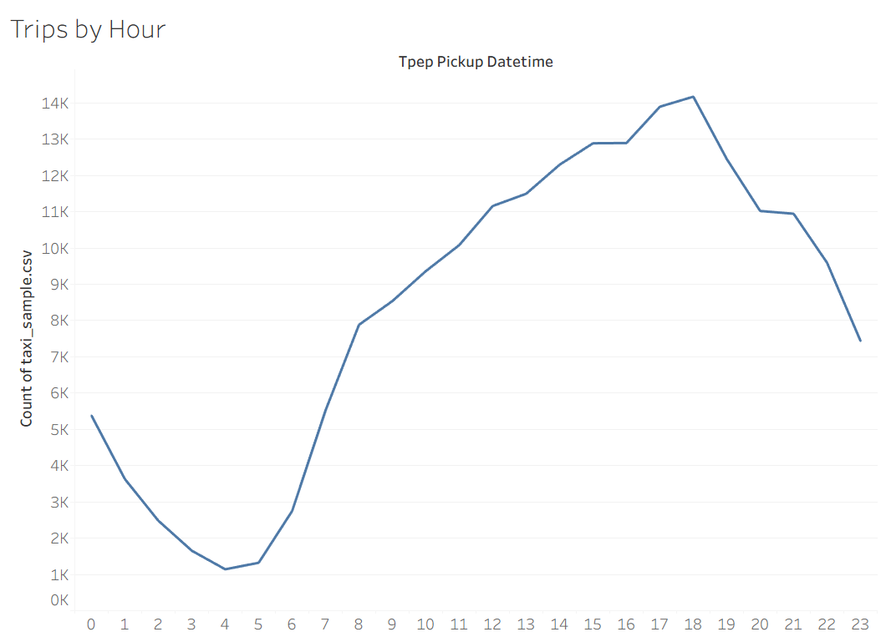
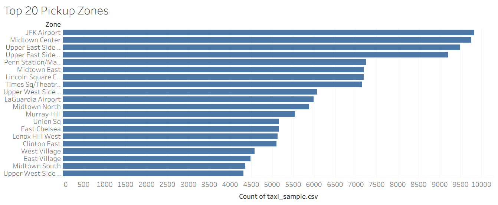
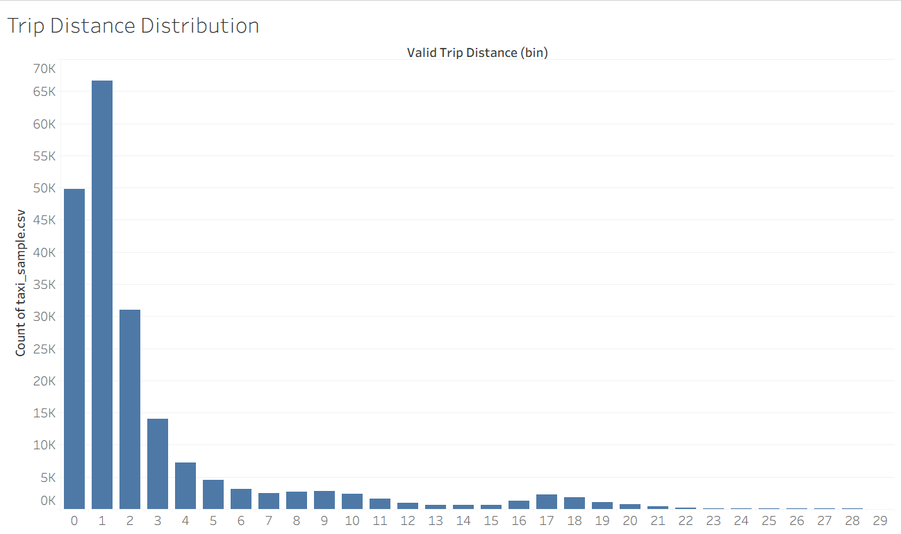
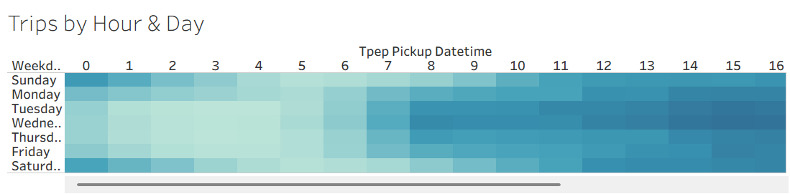
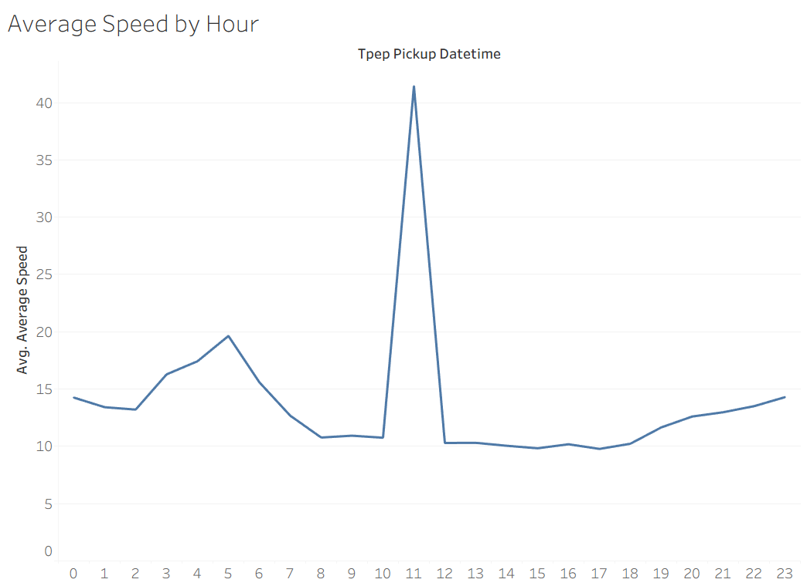
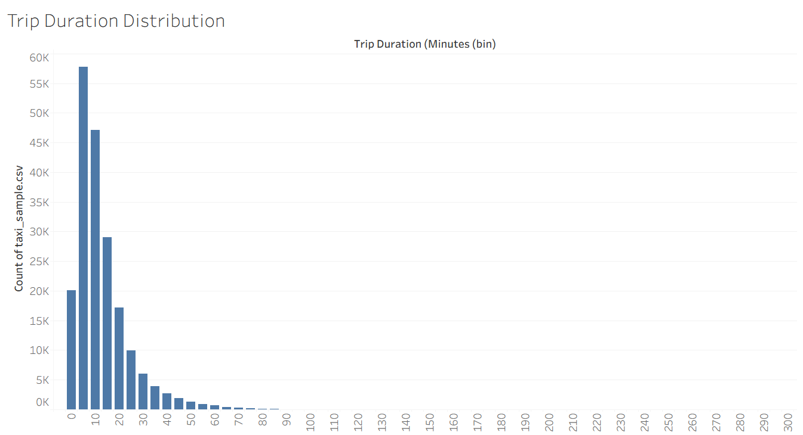
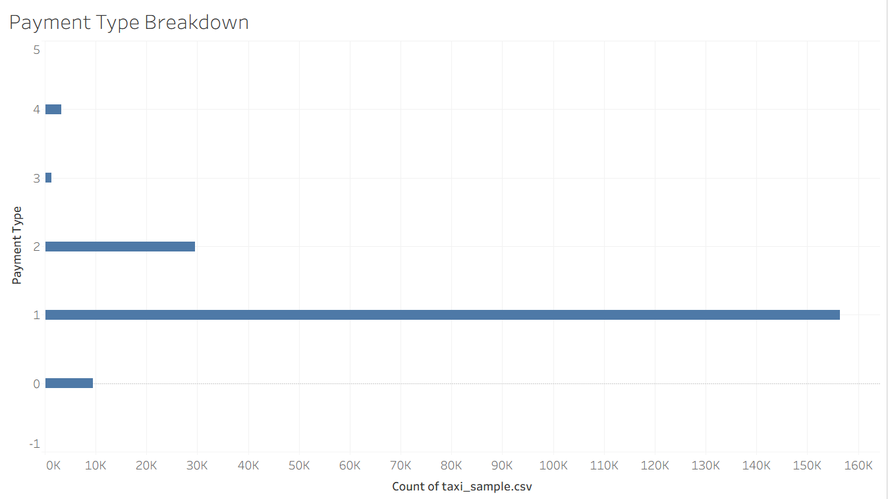
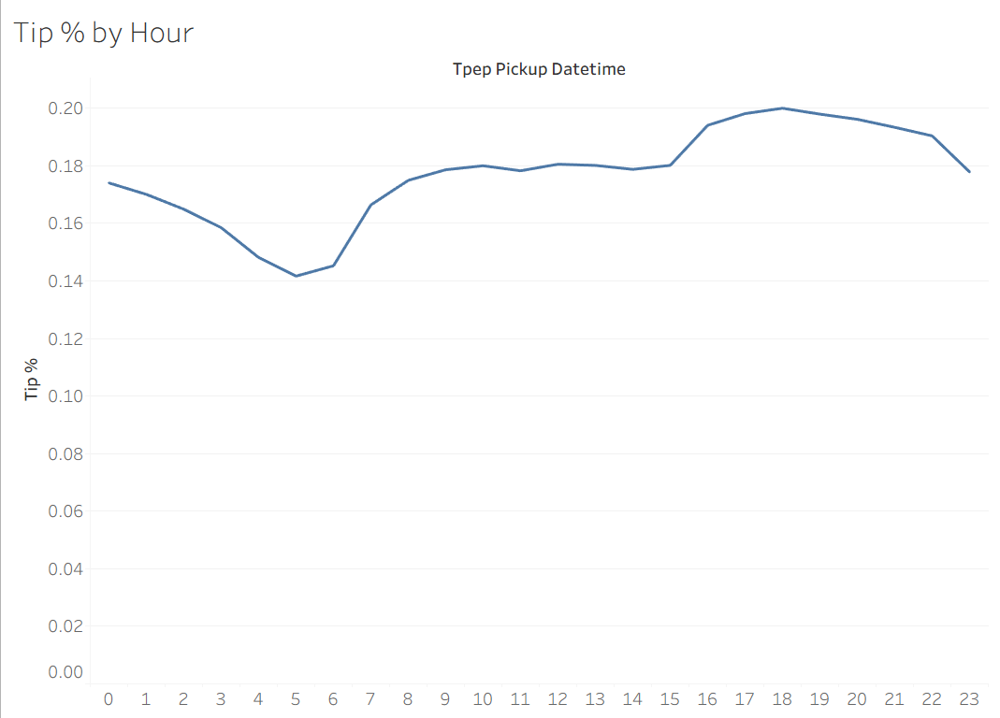
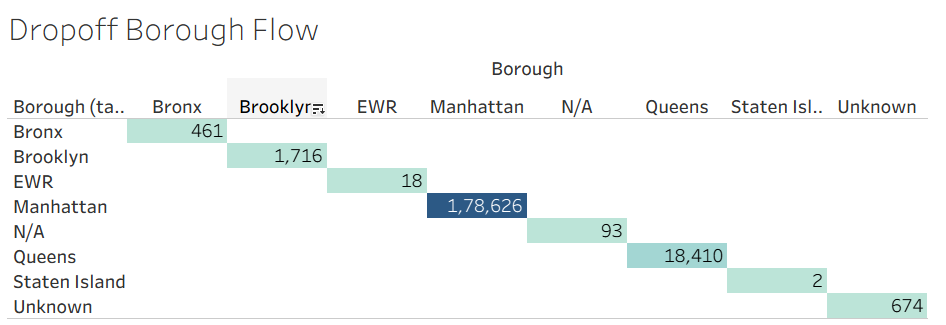
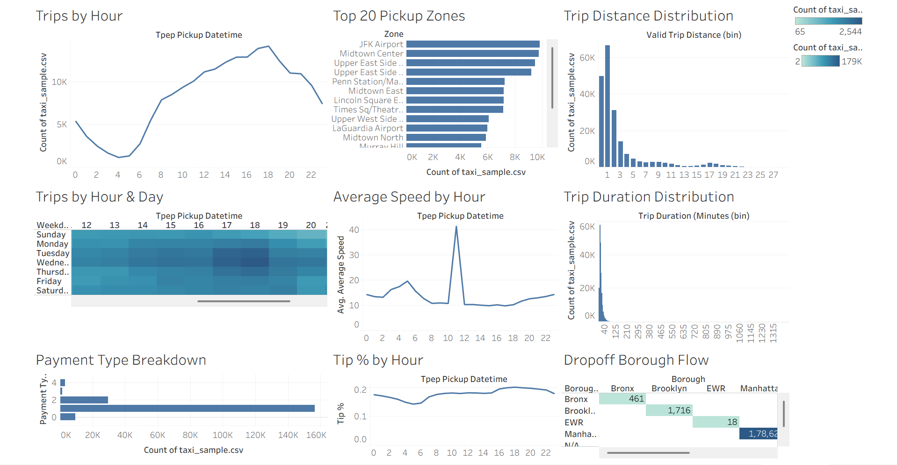

# 🚕 NYC Taxi Demand & Trip Analysis Dashboard

I analyzed **200,000 NYC Yellow Taxi trips** using **Python and Tableau** to understand taxi demand, trip distance and duration, travel speed, payment methods, tipping patterns, and borough-level trip activity.

The project includes an interactive Tableau dashboard with **9 visualizations**.

---

## 📌 Project Overview

This project explores NYC Yellow Taxi trip data across three main areas:

* 🚕 **Demand** — When and where are taxi trips most common?
* 🚦 **Trip Efficiency** — How far, how long, and how fast are trips?
* 💰 **Passenger Behavior** — How do passengers pay and tip?

The goal was to explore the data, identify useful patterns, and present the results through an interactive Tableau dashboard.

---

## 📊 Dataset

* **Source:** [NYC TLC Yellow Taxi Trip Record Data](https://www.nyc.gov/site/tlc/about/tlc-trip-record-data.page)
* **Period:** January 2024
* **Original dataset:** ~38.3 million rows, 19 columns
* **Sample used:** 200,000 randomly selected trips
* **Random state:** `42`
* **Supporting data:** [NYC Taxi Zone Lookup Table](https://www.nyc.gov/assets/tlc/downloads/csv/taxi_zone_lookup.csv)

The original dataset was very large, so I randomly selected **200,000 trips** to make the data easier to work with in Tableau.

The taxi zone lookup table maps `LocationID` to the corresponding **borough and zone names**. It was used for pickup and dropoff locations.

---

## 🐍 Data Preparation with Python

I used **pandas** to download the January 2024 Yellow Taxi dataset, randomly select 200,000 trips, and save the sample as a CSV file.

The code is available here:

[`python/data_sampling.py`](python/data_sampling.py)

```python
import pandas as pd

url = "https://d37ci6vzurychx.cloudfront.net/trip-data/yellow_tripdata_2024-01.parquet"

df = pd.read_parquet(url)

df_sample = df.sample(n=200000, random_state=42)

df_sample.to_csv("taxi_sample.csv", index=False)
```

The generated `taxi_sample.csv` is not included in the GitHub repository because it is a relatively large generated file. It can be recreated by running the Python script.

---

# 📈 Visualizations

## 1. 📊 Trips by Hour

**Question:** When during the day is taxi demand highest?

This chart shows the number of taxi trips for each pickup hour and helps identify the busiest and quietest times of the day.



---

## 2. 📍 Top 20 Pickup Zones

**Question:** Where do most taxi trips begin?

This chart shows the 20 NYC taxi zones with the highest number of pickups.



---

## 3. 📏 Trip Distance Distribution

**Question:** How far do passengers usually travel?

The trips are grouped by distance to show the most common trip lengths.

A calculated field called `Valid Trip Distance` was used and distances were capped at 30 miles to prevent extreme values from affecting the visualization.



---

## 4. 🔥 Trips by Hour & Day

**Question:** Which days and times are busiest?

This heatmap shows the number of trips for each day of the week and each pickup hour.

It helps identify specific busy periods, such as weekday evening peaks.



---

## 5. 🚦 Average Speed by Hour

**Question:** How does taxi speed change throughout the day?

Average speed was calculated using trip distance and trip duration and then compared across different pickup hours.

There is an unusual spike around **11 AM**, reaching about **41 mph**. This is likely caused by some unusual trips with high distance and very low duration, so it may be a data-quality issue rather than a real traffic pattern.



---

## 6. ⏱️ Trip Duration Distribution

**Question:** How long do taxi trips usually last?

Trip duration was calculated using the pickup and dropoff timestamps and grouped into 5-minute intervals.

Most trips are relatively short, with fewer trips as the duration increases.



---

## 7. 💳 Payment Type Breakdown

**Question:** How do passengers pay for their trips?

The chart compares the different payment types in the dataset:

* `1` — Credit card
* `2` — Cash
* `3` — No charge
* `4` — Dispute

Credit card payments are much more common than cash payments.



---

## 8. 💰 Tip Percentage by Hour

**Question:** Does tipping behavior change during the day?

Tip percentage was calculated using the tip amount and fare amount and then compared across different hours.

Looking at tip percentage instead of total tip amount gives a better comparison between trips with different fare amounts.



---

## 9. 🗺️ Dropoff Borough Flow

**Question:** How are taxi trips distributed across NYC boroughs?

The taxi zone lookup table was used to identify the borough for pickup and dropoff locations.



**Note:** The current Tableau setup does not show true cross-borough flows correctly. The matrix mainly shows same-borough combinations such as Manhattan → Manhattan. This may be caused by an issue with the pickup and dropoff joins and should be checked before using it as a true borough-flow analysis.

---

# 📊 Final Dashboard

All nine visualizations were combined into one interactive Tableau dashboard.

| Demand              | Trip Efficiency            | Passenger Behavior       |
| ------------------- | -------------------------- | ------------------------ |
| Trips by Hour       | Trip Distance Distribution | Payment Type Breakdown   |
| Top 20 Pickup Zones | Average Speed by Hour      | Tip % by Hour            |
| Trips by Hour & Day | Trip Duration Distribution | Dropoff Borough Activity |



---

# 🔎 Key Findings

* **Taxi demand follows a clear daily pattern.** Trips are lowest around **4 AM**, with approximately **1,000 trips**. Demand increases throughout the day and reaches a peak around **5–6 PM**, with approximately **14,000 trips**. There is also a busy period around **12–1 PM**, with approximately **13,000 trips**.

* **JFK Airport is the busiest pickup zone** in the sample, followed by Midtown Center and the Upper East Side.

* **Most trips are short-distance.** More than **65,000 trips** fall into the 0–1 mile range, and the number of trips decreases quickly after around 5 miles.

* **Most trips are also short in duration.** The majority of trips last less than **20 minutes**, with fewer trips in the longer-duration groups.

* **Average speed has an unusual spike around 11 AM**, reaching approximately **41 mph**. This is likely caused by unusual values in some trips and should be treated as a possible data-quality issue.

* **Credit card is the most common payment method.** Credit card trips are roughly **5 times more common than cash trips**, while no-charge and disputed trips are relatively rare.

* **Tip percentage changes during the day.** It is lowest during the early morning, around **14% at 4–5 AM**, and increases during the day, reaching around **20% at 6 PM**.

* **Manhattan has the highest number of dropoffs.** Approximately **178,626 of the 200,000 sampled trips** have a Manhattan dropoff. However, the current borough matrix mainly shows same-borough trips, so the pickup/dropoff join needs further checking before making cross-borough conclusions.

---

# 🛠️ Tools Used

* **Python**
* **Pandas**
* **Tableau**
* **NYC TLC Yellow Taxi Trip Record Data**
* **NYC Taxi Zone Lookup Table**

### Python

Used for:

* Downloading the dataset
* Sampling 200,000 trips
* Exporting the sample to CSV

### Tableau

Used for:

* Data connections
* Joins
* Calculated fields
* Binning
* Aggregations
* Filters
* Charts
* Dashboard design

---

# ▶️ How to Reproduce

### 1. Clone the repository

```bash
git clone https://github.com/singhsamiksha350/NYC_Taxi_Analysis.git
cd NYC_Taxi_Analysis
```

### 2. Install the required Python packages

```bash
pip install pandas pyarrow
```

### 3. Generate the sample dataset

```bash
python python/data_sampling.py
```

This generates:

```text
taxi_sample.csv
```

### 4. Open the Tableau workbook

Open:

```text
tableau/NYC_Taxi_Dashboard.twbx
```

in Tableau.

If Tableau asks for the data source, connect it to the generated `taxi_sample.csv` and the `taxi_zone_lookup.csv` file.

---

# 📁 Repository Structure

```text
NYC-Taxi-Data-Analysis/
│
├── README.md
│
├── data/
│   ├── .gitignore
│   └── taxi_zone_lookup.csv
│
├── python/
│   └── data_sampling.py
│
├── tableau/
│   └── NYC_Taxi_Dashboard.twbx
│
└── screenshots/
    ├── 01_trips_by_hour.png
    ├── 02_top_20_pickup_zones.png
    ├── 03_trip_distance_distribution.png
    ├── 04_trips_by_hour_day.png
    ├── 05_average_speed_by_hour.png
    ├── 06_trip_duration_distribution.png
    ├── 07_payment_type_breakdown.png
    ├── 08_tip_percentage_by_hour.png
    ├── 09_dropoff_borough_flow.png
    └── dashboard.png
```

---

## 📌 Note About `taxi_sample.csv`

`taxi_sample.csv` is intentionally **not stored in this repository** because it is a large generated file.

The `data/.gitignore` file contains:

```text
taxi_sample.csv
```

Run:

```bash
python python/data_sampling.py
```

to generate the file whenever you need it.
